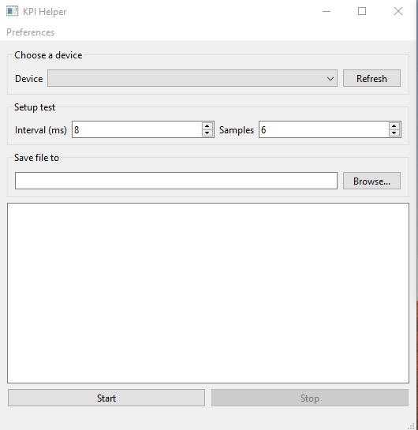

# EasyKPI
QT application in C++ to automate KPI analysis tests through an easy-to-use interface.

## Instructions:

1 - select the device from the dropdown list of connected
android devices

2 - Set test parameters of Shot-to-Shot interval and 
number of sample

3 - Choose a path where to save the files

4 - click start

